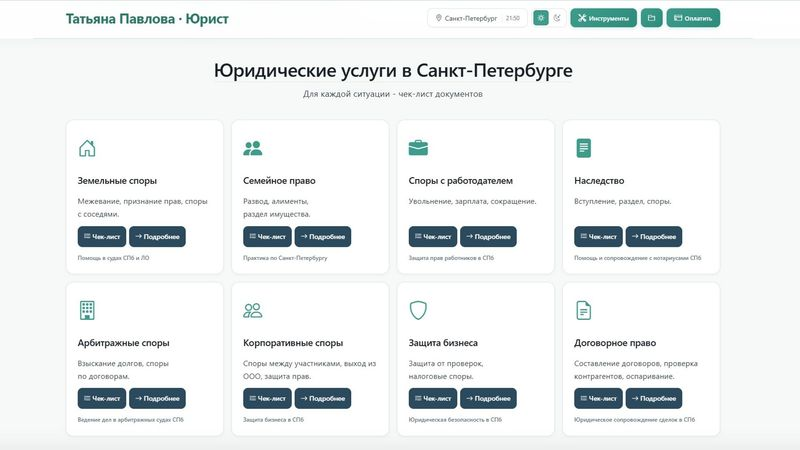
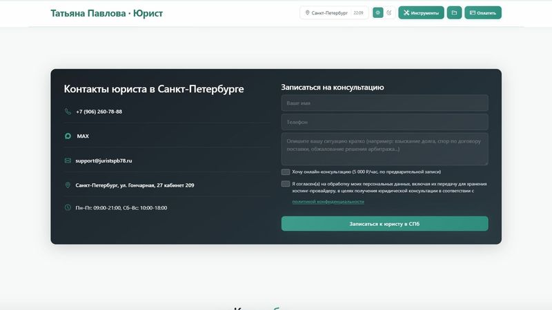
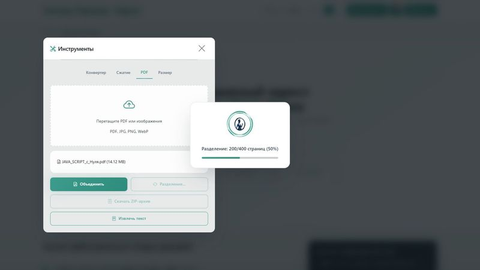
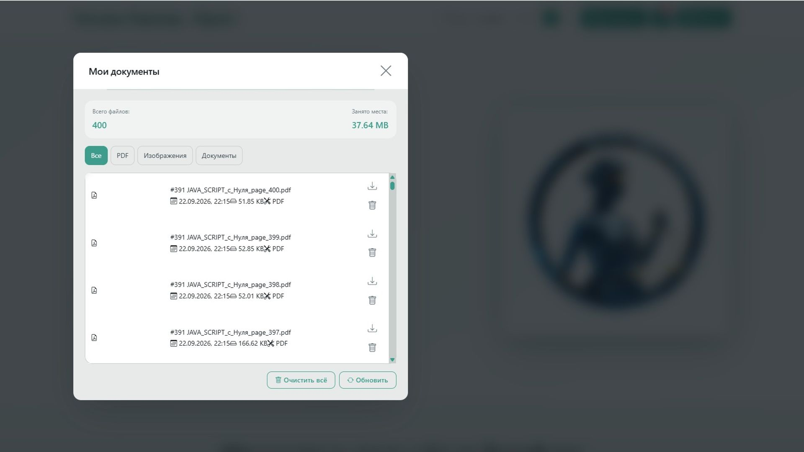
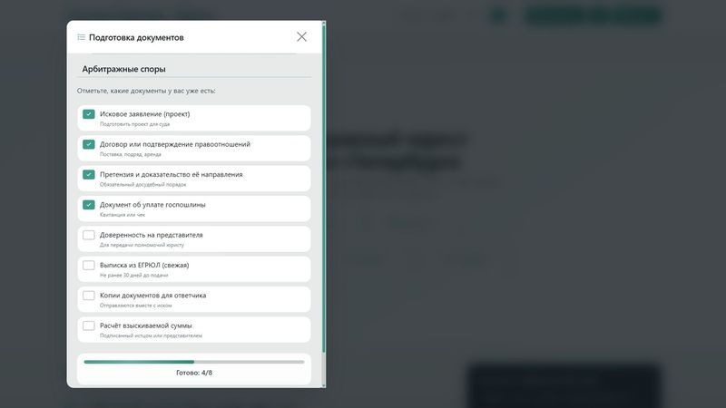

# Pavlova T.V. - PWA

Прогрессивное веб-приложение юриста Татьяны Павловой (Санкт-Петербург).

**Домен:** [juristspb78.ru](https://juristspb78.ru)

---

## Возможности

- **8 юридических услуг** - земля, семья, работа, наследство, арбитраж, корпоратив, бизнес, договоры
- **11 PDF-решений судов** - реальные дела с суммами
- **Чек-листы** по каждой услуге
- **Встроенные инструменты:**
    - Конвертер изображений (JPEG/PNG/WebP)
    - Сжатие изображений
    - Работа с PDF (объединение, разделение, извлечение текста)
    - Изменение размера изображений
- **Офлайн-режим** - Service Worker + Cache API
- **Локальное хранение файлов** - IndexedDB
- **Установка на телефон** как нативное приложение
- **Тёмная/светлая тема**
- **Адаптивный дизайн** - Container Queries + Media Queries

## Скриншоты

### Услуги



### Форма записи



### Инструменты



### Локальное хранилище



### Чек-лист



## Технологии

- **Vanilla JavaScript** - без фреймворков
- **Service Worker + Cache API** - офлайн-режим
- **IndexedDB** (idb) - локальное хранение файлов
- **pdf.js, pdf-lib, jsPDF** - работа с PDF
- **zip.js** - создание ZIP-архивов
- **Bootstrap Icons** - иконки
- **Inter, Nickainley** - шрифты
- **PHP** - backend для формы (`send.php`)
- **PHPMailer** - отправка почты

## Структура проекта

```
public_html/
├── index.html              - главная страница
├── offline.html            - офлайн-страница
├── manifest.json           - манифест PWA
├── service-worker.js       - офлайн-логика
├── send.php                - обработка формы
├── get_csrf.php            - CSRF-токен
├── screenshots/            - скриншоты для README
├── assets/
│   ├── css/                - стили
│   ├── js/                 - скрипты
│   ├── fonts/              - шрифты
│   ├── icons/              - иконки
│   └── images/             - изображения
├── zemlya/                 - земельные споры
├── semya/                  - семейное право
├── trud/                   - трудовые споры
├── nasledstvo/             - наследство
├── arbitrazh/              - арбитраж
├── korporativnye-spory/    - корпоративные споры
├── zashhita-biznesa/       - защита бизнеса
└── dogovornoe-pravo/       - договорное право
```

## Лицензия

Для ИП Павлова Т.В., безвозмездно для использования на домене juristspb78.ru.
